# 🛰️ IEEE GRSS Field Analyst Mission


> A high-stakes, real-time multiplayer geoscience game platform built for IEEE GRSS live events. Players compete across **5 sequential missions** covering remote sensing, satellite imagery analysis, disaster response, and more — designed to support **250+ concurrent participants**.

---

## 📑 Table of Contents

- [Overview](#-overview)
- [Architecture](#-architecture)
- [Tech Stack](#️-tech-stack)
- [Project Structure](#-project-structure)
- [Game Design: The 5 Missions](#-game-design-the-5-missions)
- [Scoring System](#-scoring-system)
- [Factions & Achievements](#-factions--achievements)
- [Real-Time Socket Protocol](#-real-time-socket-protocol)
- [Database Models](#-database-models)
- [API Reference](#-api-reference)
- [State Management](#-state-management)
- [Admin & Projector Panels](#-admin--projector-panels)
- [Getting Started](#-getting-started)
- [Environment Variables](#-environment-variables)
- [Deployment](#-deployment)
- [Special Features](#-special-features)

---

## 🌍 Overview

**IEEE GRSS Field Analyst** is a live-event gamified platform powered by the IEEE Geoscience & Remote Sensing Society. Players register as "Field Analysts" and are tested across 5 thematic missions covering satellite imagery identification, geoscience terminology, emoji-encoded code breaking, rapid-fire multiple-choice, and a final strategic tool-auction and disaster-response simulation.

The platform is designed for:
- **Event organisers (admins):** Full game-master control — start levels, manage questions, broadcast messages, kick players, trigger anomalies, export results.
- **Players (participants):** A mobile-friendly, dark-mode game UI with real-time feedback, powerups, and haptics.
- **Spectators / Projectors:** A dedicated large-screen projector view showing live leaderboards, faction scores, and live question statistics.

---

## 🏗️ Architecture

The application uses a **hybrid deployment model** — a Next.js frontend/API deployed to a serverless platform, and a standalone Node.js/Socket.io server deployed to a stateful long-running instance.

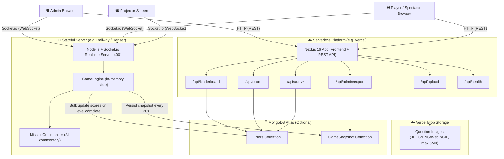

> **Key design constraint:** The WebSocket server holds all live game state in-memory for ultra-low-latency, broadcasting throttled at 1.5-second intervals to prevent broadcast storms under 250+ connections.

---

## 🛠️ Tech Stack

| Layer | Technology | Version | Purpose |
|---|---|---|---|
| Frontend Framework | Next.js (App Router) | 16.2.4 | UI, routing, SSR, REST API routes |
| UI Runtime | React | 19.2.4 | Component model |
| Styling | Tailwind CSS | 4 | Utility CSS |
| Animations | Framer Motion | 12.38.0 | Page transitions, game VFX |
| Charts | Recharts | 3.8.1 | Performance analytics |
| Drag & Drop | @dnd-kit/core | 6.3.1 | Level 5 tool placement |
| State Management | Zustand | 5.0.12 | Client-side game & auth state |
| Validation | Zod | 4.3.6 | API input validation |
| Auth | jsonwebtoken + jose | 9.0.3 / 5.9.6 | JWT session tokens (12-hour expiry) |
| Realtime | Socket.io | 4.8.3 | Bidirectional game event bus |
| ODM | Mongoose | 9.4.1 | MongoDB schema/model |
| Image Storage | @vercel/blob | 2.3.3 | CDN hosting for question images |
| Screenshot | html2canvas | 1.4.1 | Score card capture |
| Fonts | Orbitron + Exo 2 | (Google Fonts) | Sci-fi / space aesthetic |
| Linting | ESLint | 9 | Code quality |
| TypeScript | TypeScript | 5 | Type safety throughout |
| Container | Docker (node:20-alpine) | — | Realtime server packaging |

---

## 📁 Project Structure

```
grss-field-analyst/
├── app/                          # Next.js App Router
│   ├── page.tsx                  # Login / Register page
│   ├── layout.tsx                # Root layout (fonts, global UI)
│   ├── globals.css               # CSS variables, design tokens, dark theme
│   ├── dashboard/page.tsx        # Main player game screen
│   ├── admin/page.tsx            # Admin game-master dashboard
│   ├── projector/page.tsx        # Large-screen spectator view
│   ├── leaderboard/page.tsx      # Public leaderboard
│   ├── demo/page.tsx             # Interactive guided demo (5-step tour)
│   └── api/
│       ├── auth/
│       │   ├── login/route.ts    # POST — authenticate player
│       │   ├── register/route.ts # POST — register new player
│       │   ├── logout/route.ts   # POST — clear auth cookie
│       │   └── me/route.ts       # GET — session recovery from cookie
│       ├── score/route.ts        # POST — submit level score + progress
│       ├── leaderboard/route.ts  # GET — top 100 players
│       ├── upload/route.ts       # POST — upload question image (admin only)
│       ├── health/route.ts       # GET — service health check
│       └── admin/export/route.ts # GET — export results as CSV
│
├── components/
│   ├── ClientShell.tsx           # Zustand hydration wrapper
│   ├── ErrorBoundary.tsx         # React error boundary
│   ├── game/                     # All gameplay UI components
│   │   ├── IdlePhase.tsx         # Waiting lobby screen
│   │   ├── LevelIntroPhase.tsx   # Mission briefing countdown
│   │   ├── QuestionPhase.tsx     # Active question renderer
│   │   ├── ReviewPhase.tsx       # Post-answer reveal screen
│   │   ├── LevelCompletePhase.tsx # Level podium / stats
│   │   ├── GameOverPhase.tsx     # Final results
│   │   ├── AnomalyPhase.tsx      # Interrupt challenge dispatcher
│   │   ├── AuctionPhase.tsx      # Level 5 auction UI
│   │   ├── DisasterPhase.tsx     # Level 5 disaster response UI
│   │   ├── GameHUD.tsx           # Score / powerup / streak HUD
│   │   ├── MissionCommander.tsx  # AI commentary display
│   │   ├── MissionFeed.tsx       # Global mission event feed
│   │   ├── MissionLockout.tsx    # Disconnection/lockout overlay
│   │   ├── BackgroundSystem.tsx  # Animated space background
│   │   ├── ReactionOverlay.tsx   # Floating emoji reactions
│   │   ├── PerformanceCharts.tsx # Player telemetry charts
│   │   ├── PowerupVFX.tsx        # Visual effects for powerups
│   │   ├── anomalies/            # Anomaly mini-games
│   │   │   ├── WhackAMole.tsx    # 3×3 grid node-tap game
│   │   │   ├── FrequencySliders.tsx # Signal tuning sliders
│   │   │   ├── OverloadBalance.tsx  # Energy balance puzzle
│   │   │   └── WireRouting.tsx   # Circuit wire puzzle
│   │   └── level5/               # Level 5 specific sub-phases
│   │       ├── Level5Finale.tsx  # Orchestrator for 5A/5B/5C
│   │       ├── Phase5A.tsx       # Case study MCQ
│   │       ├── Phase5B.tsx       # Tool auction drag-and-drop
│   │       ├── Phase5C.tsx       # Disaster deployment
│   │       └── level5Data.ts     # Tools, case studies, prices
│   ├── admin/
│   │   ├── AdminLiveView.tsx     # Real-time admin stats panel
│   │   ├── QuestionBankPanel.tsx # Question list + management
│   │   └── QuestionManagerModal.tsx # Add/edit question modal
│   └── ui/                       # Generic UI primitives
│       ├── Toast.tsx             # Notification toast system
│       ├── TimerBar.tsx          # Countdown progress bar
│       ├── StarfieldCanvas.tsx   # Animated starfield background
│       ├── RadarCanvas.tsx       # Radar animation (projector)
│       ├── ConfettiCanvas.tsx    # Confetti on level complete
│       ├── PanicVignette.tsx     # Red vignette for final 4s
│       ├── FeedbackOverlay.tsx   # Correct/wrong overlay flash
│       ├── AnimatedCounter.tsx   # Score number animation
│       ├── ProgressDots.tsx      # Question progress indicators
│       └── HUD.tsx               # HUD component
│
├── lib/
│   ├── types.ts                  # Shared TypeScript interfaces
│   ├── scoring.ts                # Score calculation utilities
│   ├── gameData.ts               # Client-side level intro constants
│   ├── api-client.ts             # Fetch wrapper with retry logic
│   ├── achievements.ts           # Achievement definitions
│   ├── VoiceEngine.ts            # Web Speech API wrapper
│   ├── sfx.ts                    # Web Audio API sound effects
│   ├── haptics.ts                # Navigator.vibrate() haptics
│   └── db/
│       ├── connect.ts            # MongoDB connection (cached singleton)
│       └── models/
│           ├── User.ts           # User schema + model
│           └── GameSnapshot.ts   # Game state snapshot model
│
├── stores/
│   ├── useGameStore.ts           # Auth state (Zustand + localStorage persist)
│   ├── useGameSyncStore.ts       # Socket.io game state (Zustand)
│   └── useLevel5Store.ts         # Level 5 local sub-phase state
│
├── realtime/
│   ├── server.ts                 # Express HTTP + Socket.io server entry
│   ├── tsconfig.json             # Realtime server TypeScript config
│   ├── sockets/
│   │   └── game.ts               # Socket event handlers (auth middleware + all events)
│   └── game/
│       ├── GameEngine.ts         # Core game state machine
│       ├── MissionCommander.ts   # AI/rule-based post-question commentary
│       ├── gameData.ts           # Server-side question bank + level config
│       └── types.ts              # Server-side TypeScript types
│
├── public/
│   ├── images/level2/            # Satellite imagery for Level 2
│   │   ├── cyclone.jpeg
│   │   ├── drought.jpeg
│   │   ├── landslide.jpeg
│   │   ├── sar.jpeg
│   │   └── vegetation_health.jpeg
│   ├── icon.png                  # App icon (180px, 192px, 512px)
│   └── qr_code.png               # QR code for event participants
│
├── Dockerfile                    # Multi-stage Docker build (realtime server)
├── railway.json                  # Railway deployment config
├── nixpacks.toml                 # Nixpacks build config (Railway fallback)
├── next.config.ts                # Next.js config (CSP headers, image domains)
├── package.json                  # Monorepo scripts + dependencies
└── tsconfig.json                 # Root TypeScript config
```

---

## 🎮 Game Design: The 5 Missions

The game progresses through 5 sequential levels, unlocked one-by-one by the admin. All question logic (answers, scoring) lives exclusively on the server — clients only receive sanitised question objects.

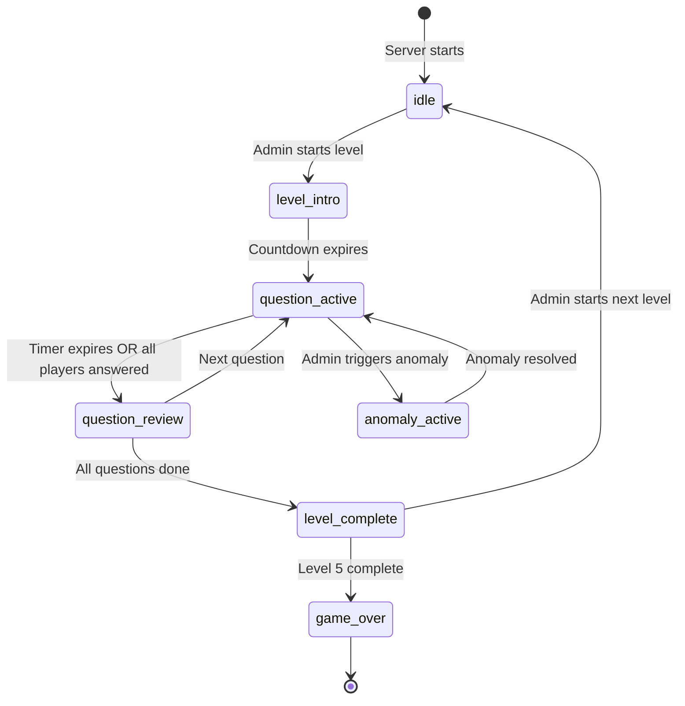

### Mission 01 — Training Mission (Level 1)
**Type:** Word Scrambles + Field Riddles
- 10 questions: 5 word scrambles and 5 riddles about remote sensing terminology.
- 60 seconds per question.
- Text input with strict answer normalisation (strips all non-alphanumeric characters, case-insensitive).
- Speed bonus awarded for fast correct answers.

### Mission 02 — Intelligence Gathering (Level 2)
**Type:** Satellite Image MCQ
- 5 questions: Real satellite images (cyclone, drought, landslide, SAR, vegetation health) presented with 4 multiple-choice answers.
- 60 seconds per image.
- Images uploaded to Vercel Blob CDN and referenced by URL — never embedded as base64.

### Mission 03 — Code Breaking (Level 3)
**Type:** Emoji Hangman
- 5 challenges: Geoscience/remote sensing terms encoded as emoji sequences.
- 120 seconds per challenge.
- Players click alphabet letters to guess. 6 wrong guesses allowed per word.
- Server tracks per-player `guessedLetters`, `lives`, `revealedPositions`, and `solved` state.
- Server sends `wordLength` but never the actual word to clients.

### Mission 04 — Rapid Assessment (Level 4)
**Type:** Multiple-Choice Quiz
- 10 questions with progressive difficulty (⭐ → ⭐⭐⭐).
- 90 seconds per question.
- Questions include a `difficulty` field (1, 2, or 3) that affects scoring weight.
- Live answer-distribution statistics broadcast to the projector in real time.

### Mission 05 — Core Simulation (Level 5)
**Type:** Strategic Tool Auction + Disaster Response
A multi-phase finale split into three sub-phases:

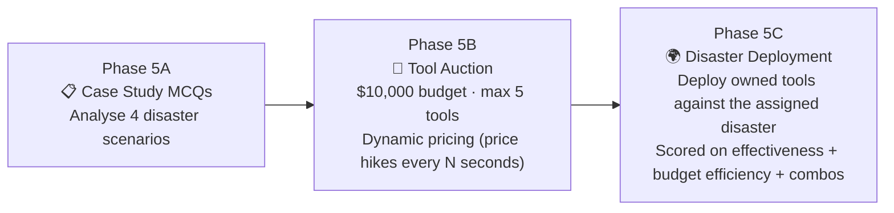

- **Phase 5A:** MCQs about assigned case studies (satellite use for disaster types).
- **Phase 5B:** Players bid on satellite monitoring tools from a shuffled auction list. Prices increase over time (`HIKE_AMT`). Budget is derived from cumulative score.
- **Phase 5C:** Players drag-and-drop owned tools into Primary / Secondary / Tertiary deployment slots against their assigned disaster. Effectiveness scoring considers tool–disaster match, slot priority, and combo bonuses.

---

## 📊 Scoring System

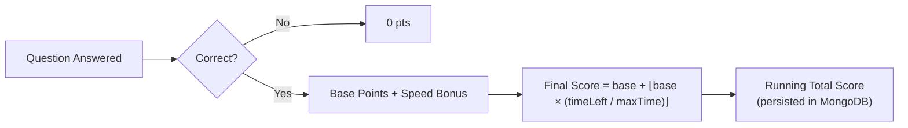

**Score tiers / player titles:**

| Score Range | Title |
|---|---|
| ≥ 3000 | Disaster Strategist |
| ≥ 2500 | Climate Guardian |
| ≥ 2000 | Resource Optimizer |
| ≥ 1500 | Earth Observer |
| ≥ 1000 | Field Analyst |
| < 1000 | GRSS Trainee |

**MongoDB uses `$max` on score updates** — only the highest score per level is retained, preventing regression from re-attempting a level.

---

## 🏅 Factions & Achievements

### Factions
On registration, players are auto-assigned to one of three factions using **balanced load distribution** (the faction with the fewest members is chosen):

| Faction ID | Display Name | Theme |
|---|---|---|
| `team_sentinel` | SENTINEL · SAR | Synthetic Aperture Radar |
| `team_landsat` | LANDSAT · OPTICAL | Optical imagery |
| `team_modis` | MODIS · THERMAL | Thermal/multispectral |

Faction aggregate scores are tracked in real-time and displayed on the projector.

### Achievements
Earned in real-time on the server and pushed to the player via `achievement_earned` socket event:

| Achievement | Trigger | Rarity |
|---|---|---|
| ⚡ Speed Demon | Answered a question in under 2 seconds | Rare |
| 🔥 High Frequency | Achieved a 5x correct answer streak | Epic |
| 🎯 Perfect Telemetry | Completed a level with 100% accuracy | Epic |
| 🩹 Lone Survivor | Won Level 3 with only 1 life remaining | Rare |
| 💰 Market Specialist | Spent 100% of auction budget effectively | Common |

---

## 📡 Real-Time Socket Protocol

The Socket.io server runs on port **4001** (configurable via `SOCKET_PORT`). Auth is enforced via JWT parsed from cookies or the socket handshake.

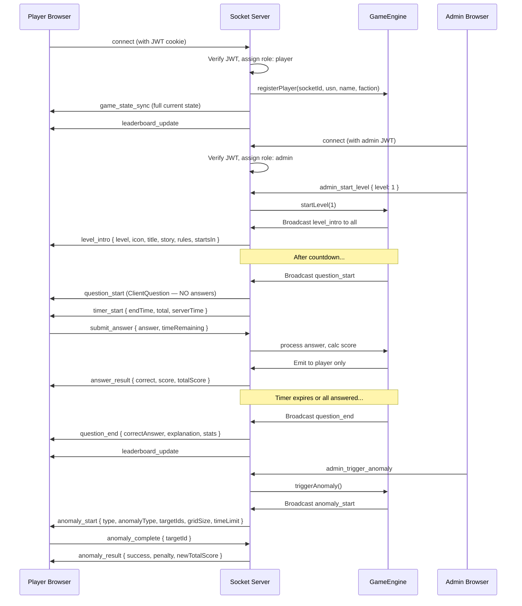

### Key Socket Events

**Server → Client (broadcasts):**

| Event | Payload | Description |
|---|---|---|
| `game_state_sync` | `GameStateSync` | Full state on connect/reconnect |
| `level_intro` | `LevelIntroPayload` | Mission briefing before level starts |
| `question_start` | `ClientQuestion` | Sanitised question (no answer/word) |
| `timer_start` | `TimerStartPayload` | Epoch `endTime` for client countdown |
| `timer_override` | `{ endTime }` | Admin timer adjustment (+10s, pause/resume) |
| `question_end` | `QuestionEndPayload` | Reveal: correct answer, explanation, stats |
| `answer_result` | `PlayerAnswer` | Per-player result (unicast to player's room) |
| `leaderboard_update` | `LeaderboardEntry[]` | Top 20 for players, full list for admins |
| `level_complete` | `LevelCompletePayload` | Podium + level stats |
| `game_over` | — | Final game end signal |
| `anomaly_start` | `AnomalyPayload` | Interrupt challenge begins |
| `anomaly_result` | `AnomalyResultPayload` | Per-player anomaly outcome (unicast) |
| `achievement_earned` | `string` (achievementId) | Unicast to earner |
| `mission_event` | `{ type, user, ... }` | Global feed (achievements, combos) |
| `global_announcement` | `string` | Admin broadcast message |
| `force_disconnect` | `{ reason }` | Kick notification |
| `admin_stats` | `AdminStatsPayload` | Admin-only live game stats |

**Client → Server (player actions):**

| Event | Payload | Description |
|---|---|---|
| `submit_answer` | `{ answer, timeRemaining }` | Submit MCQ/text answer |
| `hangman_guess` | `{ letter }` | Guess a letter in Level 3 |
| `auction_buy` | `{ toolId }` | Purchase a tool in Level 5 |
| `disaster_deploy` | `{ toolIds }` | Deploy tools in Level 5 |
| `send_reaction` | `{ emoji }` | Send a floating reaction emoji |
| `anomaly_complete` | `{ targetId }` | Signal anomaly resolution |
| `request_full_sync` | — | Request full state resync |

**Client → Server (admin actions):**

| Event | Description |
|---|---|
| `admin_start_level` | Start a specific level |
| `admin_pause_game` | Toggle pause/resume |
| `admin_reset_game` | Reset entire game state |
| `admin_timer_add_10` | Add 10 seconds to current timer |
| `admin_timer_pause_resume` | Pause/resume the question timer |
| `admin_force_end_question` | Skip immediately to review phase |
| `admin_load_bank` | Load a set of questions into the server bank |
| `admin_add_bank_question` | Add a single question |
| `admin_update_bank_question` | Edit an existing bank question |
| `admin_delete_bank_question` | Remove a question from the bank |
| `admin_get_bank` | Fetch all bank questions |
| `admin_update_level_limit` | Set maximum questions per level |
| `admin_kick_player` | Remove a player and delete from DB |
| `admin_sabotage_player` | Apply score penalty to a player |
| `admin_trigger_anomaly` | Trigger an anomaly interrupt challenge |
| `admin_trigger_scenario` | Trigger a named scenario (`solar_flare`, `data_corruption`) |
| `admin_global_broadcast` | Send a message to all connected clients |

---

## 🗄️ Database Models

### User

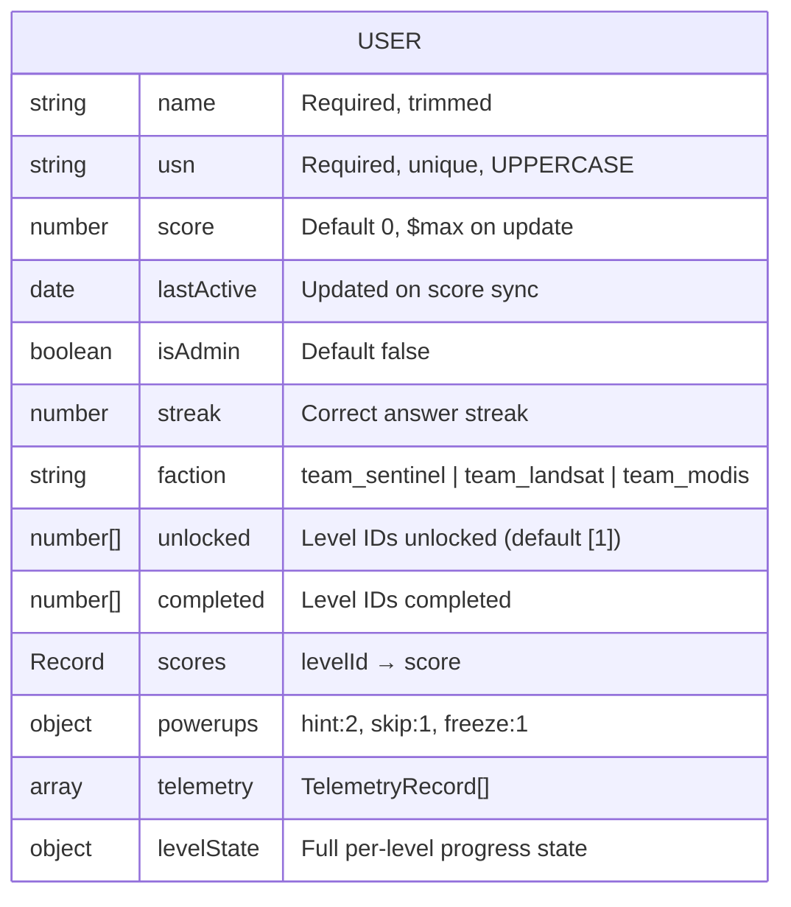

**`levelState` sub-document tracks:**
- Levels 1–4: `l{N}idx` (question index), `l{N}score`, `l{N}correct`
- Level 3 Hangman extras: `l3guessed[]`, `l3lives`, `l3hintGiven`
- Level 5 Auction: `budget`, `bought[]`, `priceMulti`, `auctScore`
- Level 5 Disaster: `disasterId`, `applied[]`, `disasterScore`

### GameSnapshot

Persisted every ~20 seconds by the `GameEngine`. On server restart, the engine hydrates from this document to restore the live game without resetting 250+ players' progress.

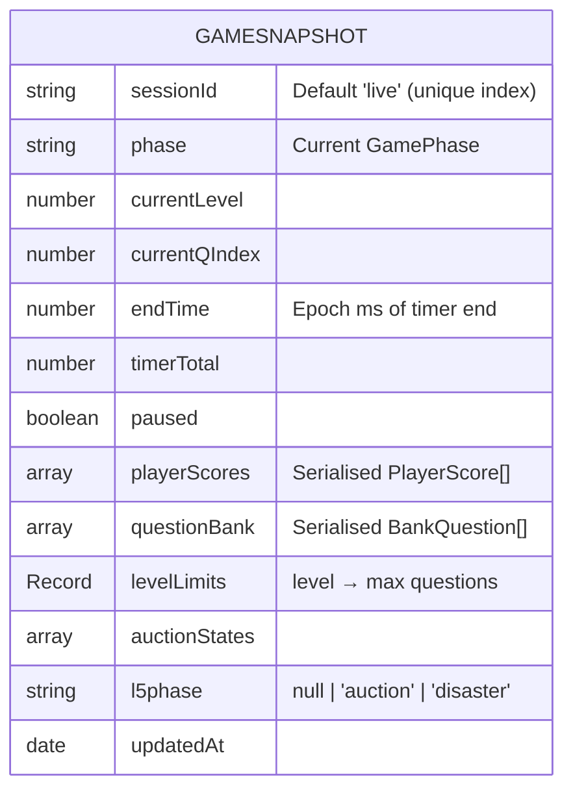

---

## 🔌 API Reference

All REST endpoints are Next.js App Router route handlers.

### Auth

**`POST /api/auth/register`**
Registers a new player. Auto-assigns a faction using balanced load distribution.
```json
Request:  { "name": "Jane Doe", "usn": "1MS21CS001" }
Response: { "status": "ok", "user": { ...userState } }
```

**`POST /api/auth/login`**
Authenticates a player by name + USN match. Returns a 12-hour JWT set as an HttpOnly cookie.
```json
Request:  { "name": "Jane Doe", "usn": "1MS21CS001" }
Response: { "status": "ok", "user": { ...userState }, "token": "..." }
```

**`POST /api/auth/logout`**
Clears the `auth_token` cookie.

**`GET /api/auth/me`**
Validates the existing cookie and returns the current user session (used for cookie-based session recovery when localStorage is cleared).

### Game

**`POST /api/score`** *(requires auth cookie)*
Submits a completed level score and full progress state. Uses MongoDB `$max` to only update if the new score is higher.
```json
Request: {
  "name": "Jane Doe",
  "usn": "1MS21CS001",
  "score": 1850,
  "progress": { "unlocked": [1,2], "completed": [1], "scores": { "1": 1850 }, ... }
}
```

**`GET /api/leaderboard`**
Returns the top 100 players sorted by score (excluding admins).
```json
Response: { "status": "ok", "count": 42, "entries": [{ "name", "usn", "score", "date" }] }
```

### Admin

**`POST /api/upload`** *(requires admin auth cookie)*
Uploads a question image to Vercel Blob. Accepts JPEG, PNG, WebP, GIF up to 5MB. Returns the CDN URL.

**`GET /api/admin/export`**
Exports all player scores from the latest GameSnapshot as a downloadable CSV with columns: Rank, Name, USN, Faction, Total Score, Mission 1–5.

**`GET /api/health`**
Returns server health status.

---

## 🧠 State Management

The application uses **Zustand** for all client-side state with three stores:

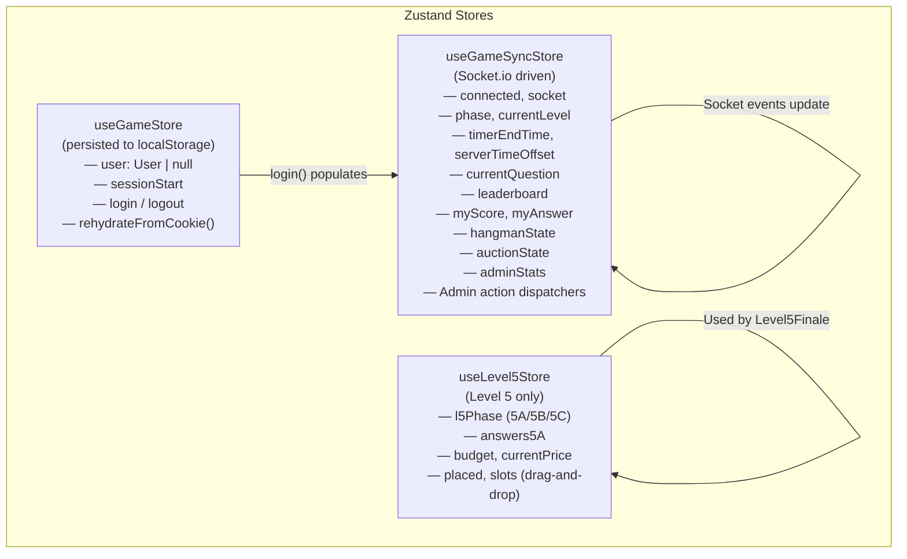

**Session recovery flow:** If a player's `localStorage` is cleared but the HttpOnly JWT cookie still exists, `rehydrateFromCookie()` calls `GET /api/auth/me` to silently restore the session without requiring re-login.

**Timer architecture:** The server sends an epoch `endTime` rather than ticking events. Clients compute `remaining = endTime - (Date.now() - serverTimeOffset)` via `requestAnimationFrame` loops — this eliminates timer drift and prevents broadcast storms under load.

---

## 🖥️ Admin & Projector Panels

### Admin Dashboard (`/admin`)
The admin panel provides full game-master control:
- **Level control:** Start any level, pause/resume, force-end the current question, reset the entire game.
- **Timer control:** Add 10 seconds to the current timer, pause/resume the timer independently.
- **Question bank:** Add, edit, delete questions with a form-based modal. Supports all question types (scramble, riddle, image MCQ, hangman, MCQ). Set per-level question limits.
- **Image upload:** Upload images directly to Vercel Blob CDN from within the admin panel.
- **Live stats:** Real-time answer distribution, connected player count, faction scores, current phase.
- **Player management:** Kick players (removes from DB), apply score penalties (sabotage).
- **Broadcast:** Send a global announcement message to all connected clients.
- **Anomaly triggers:** Trigger any anomaly type or named scenario.
- **Export:** Download the full session results as a CSV.

### Projector View (`/projector`)
A dedicated spectator screen designed for a large display at a live event:
- Animated starfield + radar canvas background.
- Scrolling telemetry ticker (orbital altitude, swath width, SAR frequency, etc.).
- Live question display with timer progress bar.
- Real-time leaderboard with animated score counters.
- Faction score breakdown (SENTINEL / LANDSAT / MODIS).
- Floating reaction emoji overlay from player reactions.
- Level complete podium with staggered bar animations.
- Connects as a `spectator` role — no auth required, read-only access.

---

## 🚀 Getting Started

### Prerequisites
- **Node.js** 18+ (20 recommended)
- **MongoDB** (optional — falls back to a fresh in-memory state if unavailable)
- **npm** (included with Node.js)

### Installation

Clone the repository and install all dependencies from the root:

```bash
git clone https://github.com/Javeria-taj/grss-field-analyst.git
cd grss-field-analyst
npm install
```

### Development

Start both the Next.js frontend and the realtime Socket.io server concurrently:

```bash
npm run dev
```

This runs:
- `next dev` → Frontend + REST API at `http://localhost:3000`
- `nodemon ... realtime/server.ts` → Socket server at `ws://localhost:4001`

### Production Build

Build the Next.js frontend:
```bash
npm run build
npm start
```

Compile and start the realtime server:
```bash
npm run build:realtime
npm run start:realtime:prod
```

### Available Scripts

| Script | Description |
|---|---|
| `npm run dev` | Start frontend + realtime server concurrently (development) |
| `npm run dev:frontend` | Next.js dev server only |
| `npm run dev:realtime` | Realtime server only (with nodemon hot-reload) |
| `npm run build` | Build Next.js for production |
| `npm run build:realtime` | Compile realtime server TypeScript → JavaScript |
| `npm run start` | Start Next.js production server |
| `npm run start:realtime` | Start realtime server via ts-node |
| `npm run start:realtime:prod` | Start compiled realtime server (post build) |
| `npm run lint` | Run ESLint |

---

## 🔑 Environment Variables

Create a `.env` file in the root directory:

```bash
# ── Database ──────────────────────────────────────────────────────────────
# Optional — if omitted, the game runs without persistence
MONGODB_URI=mongodb+srv://<user>:<password>@cluster.mongodb.net/grss

# ── Authentication ────────────────────────────────────────────────────────
# CRITICAL: Change this in production. Must be identical on both servers.
SESSION_SECRET=grss_super_secret_change_in_production

# ── Admin Credentials ─────────────────────────────────────────────────────
ADMIN_USN=SUPER_ADMIN
ADMIN_NAME=javeria_taj

# ── Realtime Socket Server ────────────────────────────────────────────────
# Set on the FRONTEND — tells the Next.js app where the Socket.io server is
NEXT_PUBLIC_SOCKET_URL=https://your-realtime-server.up.railway.app

# ── CORS for Realtime Server ──────────────────────────────────────────────
# Set on the REALTIME SERVER — allowed frontend origins (comma-separated)
CLIENT_URL=https://your-frontend.vercel.app

# ── Socket Server Port ────────────────────────────────────────────────────
SOCKET_PORT=4001

# ── Image Storage (Vercel Blob) ───────────────────────────────────────────
# Required for question image uploads (auto-configured on Vercel)
BLOB_READ_WRITE_TOKEN=vercel_blob_rw_...

# ── Optional: AI Commentary ───────────────────────────────────────────────
# If set, MissionCommander uses GPT-4o-mini for post-question commentary
# If not set, falls back to the built-in rule-based commentary engine
AI_API_KEY=sk-...
```

---

## 🚢 Deployment

> ⚠️ **Critical:** The application **must** be deployed as two separate services.

### Service 1: Frontend + REST API → Serverless (Vercel recommended)

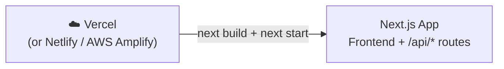

1. Deploy the repository root to Vercel.
2. Set all environment variables in the Vercel dashboard.
3. The `NEXT_PUBLIC_SOCKET_URL` must point to the Railway/Render URL of Service 2.

### Service 2: Realtime Socket Server → Stateful Container (Railway recommended)

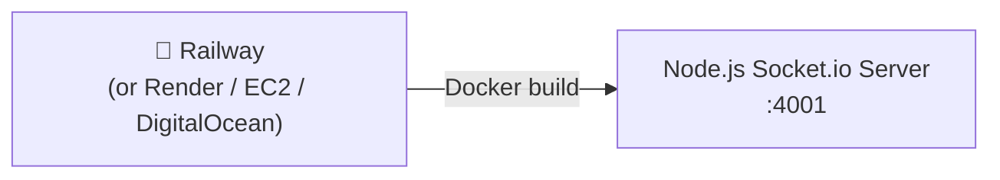

The repository includes a ready `Dockerfile` and `railway.json`:

```bash
# Railway uses the Dockerfile automatically
# The build produces: realtime/dist/realtime/server.js
# Start command: node realtime/dist/realtime/server.js
```

Set `CLIENT_URL`, `SESSION_SECRET`, `MONGODB_URI`, and `ADMIN_USN`/`ADMIN_NAME` on the Railway service.

### Deployment Architecture Summary

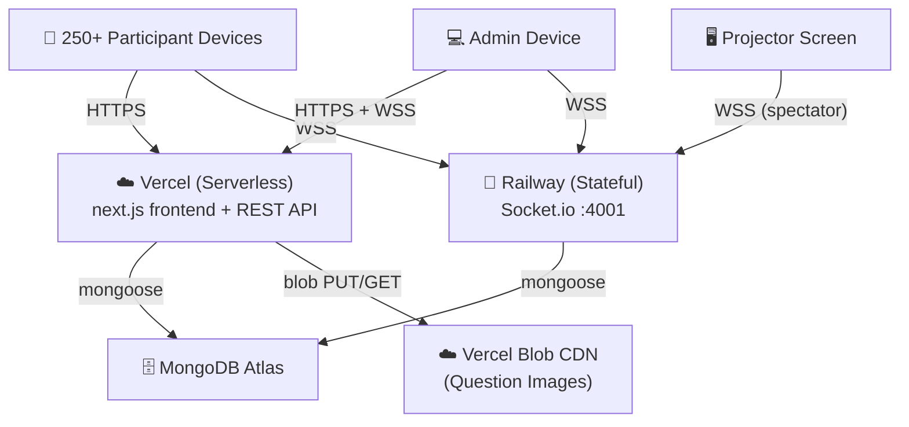

**Required environment variable alignment:**
- `SESSION_SECRET` — **must be identical** on both Vercel and Railway. JWT tokens are issued by the Next.js API and verified by the Socket.io server's auth middleware.

---

## ✨ Special Features

### Anomaly System
At any point during a live level, the admin can trigger a **satellite anomaly** — an interrupt challenge that temporarily freezes the regular game and forces all players to complete a mini-game within a time limit. Failing incurs a score penalty.

Four anomaly types:
- **Whack-a-Mole:** Tap the active node in a 3×3 grid to neutralise malware (5 taps required).
- **Frequency Sliders:** Tune multiple signal sliders to target values.
- **Wire Routing:** Connect circuit endpoints without crossing paths.
- **Overload Balance:** Distribute energy load evenly across nodes.

### Mission Commander (AI Commentary)
After each question, the `MissionCommander` generates post-result commentary based on class accuracy:
- If `AI_API_KEY` is set → calls **GPT-4o-mini** for dynamic, personality-driven commentary (max 15 words, mood-calibrated).
- Otherwise → a built-in rule-based engine produces contextual commentary based on accuracy thresholds (0%, <25%, >70%, >90%, anomaly phase, etc.).

### Powerup System
Each player starts with **2 Hints, 1 Skip, 1 Freeze**:
- **Hint:** Reveals a clue for the current question.
- **Skip:** Advances to the next question without penalty.
- **Freeze:** Pauses the local timer briefly.

### SFX & Haptics
All sound effects are generated procedurally using the **Web Audio API** — no external audio files required. On mobile, the **Vibration API** (`navigator.vibrate`) provides tactile haptic feedback:
- Light buzz for button clicks.
- Double buzz for wrong answers.
- Rhythmic heartbeat for the Disaster phase.
- Success pulse for correct answers.

### Demo Mode (`/demo`)
An interactive 5-step guided tour for new players before registration, covering the HUD, auction mechanics, glossary of terms, and scoring system.

### Panic Mode
When a question timer drops to 4 seconds, a **red vignette overlay** (`PanicVignette`) activates and a siren sound (`SFX.startPanic()`) begins. Both are forcibly stopped the moment the phase changes, preventing audio bleed between screens.

### Session Recovery
If a player's `localStorage` is cleared mid-event but their HttpOnly JWT cookie is still valid, calling `GET /api/auth/me` silently restores their session — preventing the need to re-register during a live event.

### Crash Recovery
The `GameEngine` **persists a full snapshot to MongoDB every ~20 seconds** via the `GameSnapshot` model. On server restart (e.g., Railway redeploy), the engine calls `hydrateFromDb()` at boot to restore the exact game phase, all player scores, the question bank, auction states, and the current question index — preventing data loss for 250+ players.

---

*Created for the IEEE GRSS community. Built with Next.js, Socket.io, and MongoDB.*
